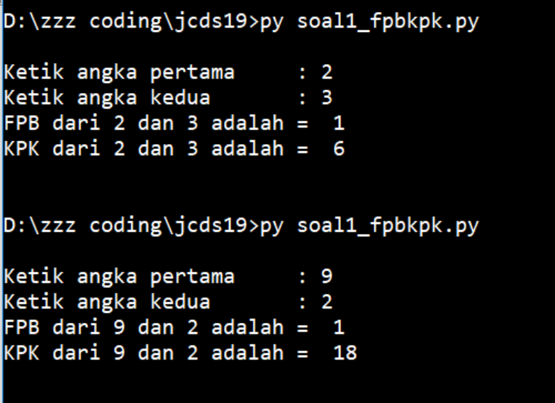
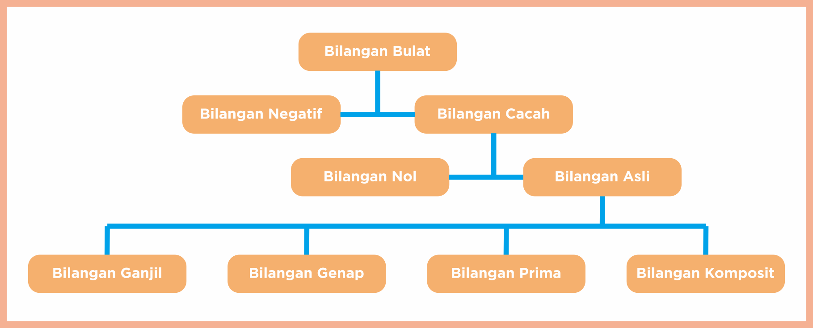
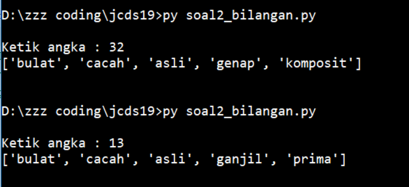
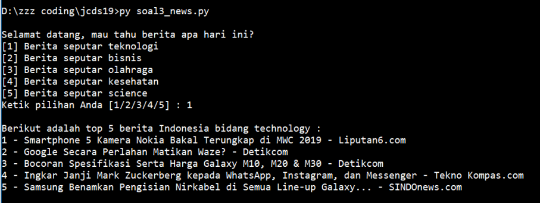

# Soal Ujian Python Data Science Fundamental


#

### **Soal 1 - FPB & KPK**

Buatlah sebuah __file Python interaktif__ yang mengandung **sebuah function** untuk menentukan nilai **FPB** (_Faktor Persekutuan Besar_) & **KPK** (_Kelipatan Persekutuan Kecil_) dari 2 buah bilangan. Pembahasan seputar FPB & KPK pernah kita pelajari bersama di bangku Sekolah Dasar, masih ingat dong?

- __Case Flow__: Saat dieksekusi, program akan meminta user memasukkan 2 buah angka secara bebas. Kemudian user akan mendapatkan nilai FPB dan KPK dari 2 buah angka yang dimasukkan.

- Output yang diharapkan saat file diekseskusi via terminal:
  
  ```bash
  Ketik angka pertama     : 3
  Ketik angka kedua       : 2
  FPB dari 3 dan 2 adalah : 1
  KPK dari 3 dan 2 adalah : 6
  ```

- Contoh screenshot:

    

_**Catatan:**_ _Commit & push source code project ke __Github__ Anda, buatlah repo dengan nama __Ujian_FPB_KPK__. Kemudian lampirkan __url link repo Github__ Anda via email: lintang@purwadhika.com!_

#

### **Soal 2 - Kategori Bilangan**

Buatlah sebuah __file Python__ yang mengandung **sebuah return function** untuk menentukan kategori bilangan sebuah angka. Misal: angka __13__ tergolong bilangan __*bulat*__, **_cacah_**, *__asli__*, **_ganjil_** & __*prima*__. Berikut adalah definisi & pengkategorian bilangan menurut laman Wikipedia [(klik di sini)](https://id.wikipedia.org/wiki/Bilangan):

- __Bilangan Bulat__: Bilangan yang terdiri atas bilangan cacah (0, 1, 2, 3, ...) beserta nilai negatifnya (0, -1, -2, -3, ...). Bilangan bulat dapat dituliskan tanpa komponen desimal atau pecahan.

- __Bilangan Cacah__: Himpunan bilangan bulat yang tidak bernilai negatif, yaitu (0, 1, 2, 3 ...).

- __Bilangan Negatif__: Himpunan bilangan bulat yang nilainya lebih kecil dari 0, yaitu (-1, -2, -3, ...)

- __Bilangan Nol__: Yaitu 0

- __Bilangan Asli__: Himpunan bilangan cacah positif yang bukan nol, yaitu (1, 2, 3, ...)

- __Bilangan Ganjil__: Himpunan bilangan asli positif yang nilainya tidak habis dibagi 2, yaitu (1, 3, 5, 7, 9, ...)

- __Bilangan Genap__: Himpunan bilangan asli positif yang nilainya habis dibagi 2, yaitu (2, 4, 6, 8, 10, ...). Bilangan nol (0) juga digolongkan sebagai bilangan genap.

- __Bilangan Prima__: Himpunan bilangan asli yang nilainya lebih besar daripada 1, yang faktor pembaginya adalah 1 dan bilangan itu sendiri. 2 dan 3 adalah bilangan prima. 4 bukan bilangan prima karena dapat dibagi 2.

- __Bilangan Komposit__: Himpunan bilangan asli yang nilainya lebih besar daripada 1, yang bukan merupakan bilangan prima.

  

- __Case Flow__: Saat dieksekusi, program akan meminta user memasukkan angka secara bebas. Kemudian user akan mendapatkan kategori bilangan dari angka yang dimasukkan, dalam bentuk __list__.

- Output yang diharapkan saat file diekseskusi via terminal:
  
  ```bash
  Ketik angka : 2
  ['bulat', 'cacah', 'asli', 'genap', 'prima']

  Ketik angka : 15
  ['bulat', 'cacah', 'asli', 'ganjil', 'komposit']
  ```

- Contoh screenshot:

    

_**Catatan:**_ _Commit & push source code project ke __Github__ Anda, buatlah repo dengan nama __Ujian_Kategori_Bilangan__. Kemudian lampirkan __url link repo Github__ Anda via email: lintang@purwadhika.com!_

#

### **Soal 3 - Top 5 News API**

Buatlah sebuah __file Python interaktif__ untuk menyajikan top 5 informasi/berita hari ini kepada user seputar _teknologi, bisnis, olahraga, kesehatan_ dan _sains_ di Indonesia. Gunakan __News API__ [(klik di sini)](https://newsapi.org), login & dapatkan __API Key__ untuk menggunakan API tersebut. Untuk memanfaatkan API berita seputar _teknologi, bisnis, olahraga, kesehatan_ dan _sains_ di Indonesia, baca dokumentasi berikut:
1. [News API - Berita Indonesia - Teknologi](https://newsapi.org/s/indonesia-technology-news-api)
2. [News API - Berita Indonesia - Bisnis](https://newsapi.org/s/indonesia-business-news-api)
3. [News API - Berita Indonesia - Olahraga](https://newsapi.org/s/indonesia-sports-news-api)
4. [News API - Berita Indonesia - Kesehatan](https://newsapi.org/s/indonesia-health-news-api)
5. [News API - Berita Indonesia - Sains](https://newsapi.org/s/indonesia-science-news-api)

- __Case Flow__: Saat dieksekusi, program akan menawarkan 5 pilihan berita kepada user, yakni berita seputar _teknologi, bisnis, olahraga, kesehatan_ dan _sains_ di Indonesia. Usai user menentukan pilihan, program akan menyajikan __top 5 judul berita hari__ ini di bidang yang user pilih. _Cukup judul beritanya saja!_

- __Note__: Selesaikan hanya dengan memanfaatkan __requests__ package! News API menyediakan package khusus untuk Python yang dapat Anda install melalui pip ([selengkapnya klik sini](https://newsapi.org/docs/client-libraries/python)):

    ```bash
    $ pip install newsapi-python
    ```
    Namun Anda tidak diperkenankan menggunakan package tersebut. Cukup dengan __requests__ package saja.

- Output yang diharapkan saat file diekseskusi via terminal:
  
  ```bash
    Selamat datang, mau tahu berita apa hari ini?
    [1] Berita seputar teknologi
    [2] Berita seputar bisnis
    [3] Berita seputar olahraga
    [4] Berita seputar kesehatan
    [5] Berita seputar science
    Ketik pilihan Anda [1/2/3/4/5] : 3

    Berikut adalah top 5 berita Indonesia bidang sports :
    1 - Coutinho Memble, Valverde Membela - Bola.net
    2 - Beda Mourinho dan Solskjaer Versi Winger MU - Bola - Liputan6.com
    3 - Lorenzo Anggap Marquez Sama dengan Rossi - Kompas.com - KOMPAS.com
    4 - Anders Antonsen, Juara Narsis yang Idolakan Taufik Hidayat - VIVA.co.id
    5 - Final Tragis, Ratu Bulutangkis Dunia Mendadak Terkapar di Senayan - VIVA - VIVA.co.id
  ```

- Contoh screenshot:

    

_**Catatan:**_ _Commit & push source code project ke __Github__ Anda, buatlah repo dengan nama __Ujian_Top5_News__. Kemudian lampirkan __url link repo Github__ Anda via email: lintang@purwadhika.com!_

#

### *__#HappyCoding__* :relaxed:

#### Lintang Wisesa :love_letter: _lintangwisesa@ymail.com_

[Facebook](https://www.facebook.com/lintangbagus) | 
[Twitter](https://twitter.com/Lintang_Wisesa) |
[Google+](https://plus.google.com/u/0/+LintangWisesa1) |
[Youtube](https://www.youtube.com/user/lintangbagus) | 
:octocat: [GitHub](https://github.com/LintangWisesa) |
[Hackster](https://www.hackster.io/lintangwisesa)
